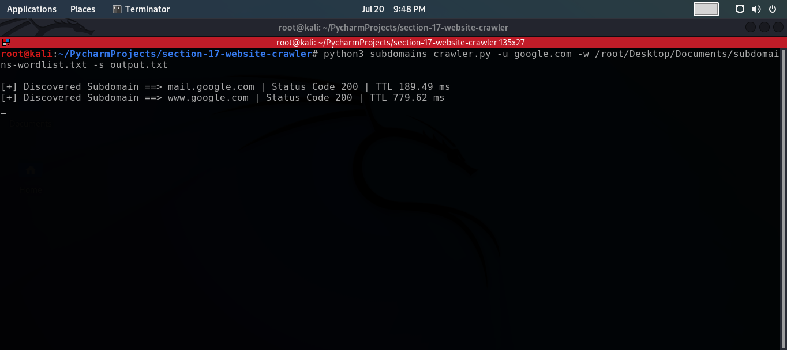
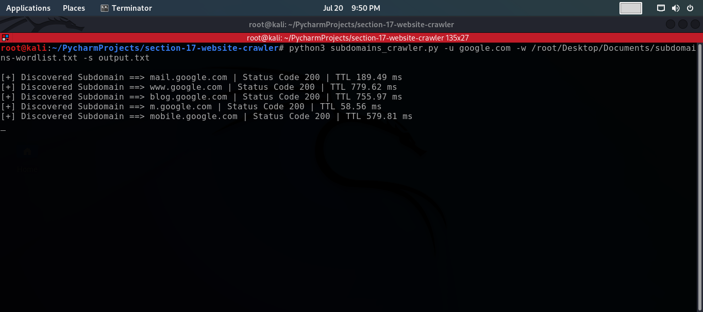

# Subdomain Scanner
This is a Python script that scans for subdomains of a target website using a wordlist of domain names.

## Table of Contents
- Description
- Requirements
- Usage
- Options
- Example
- Screenshots
- Key Features

## Description
The Subdomain Scanner is a simple Python script that takes a target URL and a wordlist of domain names as input. It then appends each word in the wordlist to the target URL to create potential subdomains and sends HTTP requests to check if these subdomains are valid. If a subdomain responds with a successful HTTP status code (2xx), it is considered a discovered subdomain, and its details are printed to the console. Optionally, you can save the discovered subdomains to a specified output file.

## Requirements
- Python 3.x
- requests library (can be installed using `pip install requests`)

## Usage
To run the Subdomain Scanner, use the following command format:
    ```commandline
    python3 subdomains_crawler.py -u <target_url> -w <wordlist_file> [-s <output_file>]
    ```

## Options
- The Subdomain Scanner supports the following options:
    - `-u, --url`: (required) Specifies the target URL of the website for subdomain scanning.
    - `-w, --wordlist`: (required) Specifies the wordlist file in .txt format containing domain names for subdomain generation.
    - `-s, --save`: (optional) Specifies the output file name to save the discovered subdomains.

## Example
- To scan for subdomains of the target website `example.com` using the wordlist `wordlist.txt` and save the results to `subdomains.txt`, run the following command:
    ```commandline
    python3 subdomains_crawler.py -u example.com -w wordlist.txt -s subdomains.txt
    ```
- The script will then scan the subdomains and display discovered subdomains with their corresponding status codes and response times. The results will also be saved in the specified output file.

## Key Features
1. **Wordlist-Based Subdomain Generation:** The script takes a user-provided wordlist containing domain names and appends each word to the target URL, creating potential subdomains to scan.

2. **HTTP Request Validation:** The Subdomain Scanner sends HTTP requests to the generated subdomains and validates their responsiveness. If a subdomain responds with a successful HTTP status code (2xx), it is considered a discovered subdomain.

3. **Real-Time Display:** During the scanning process, the script displays real-time updates, showing each discovered subdomain along with its status code and response time.

4. **Output File Option:** Users have the option to specify an output file name to save the discovered subdomains. This provides a convenient way to review and analyze the results later.

## Screenshots


